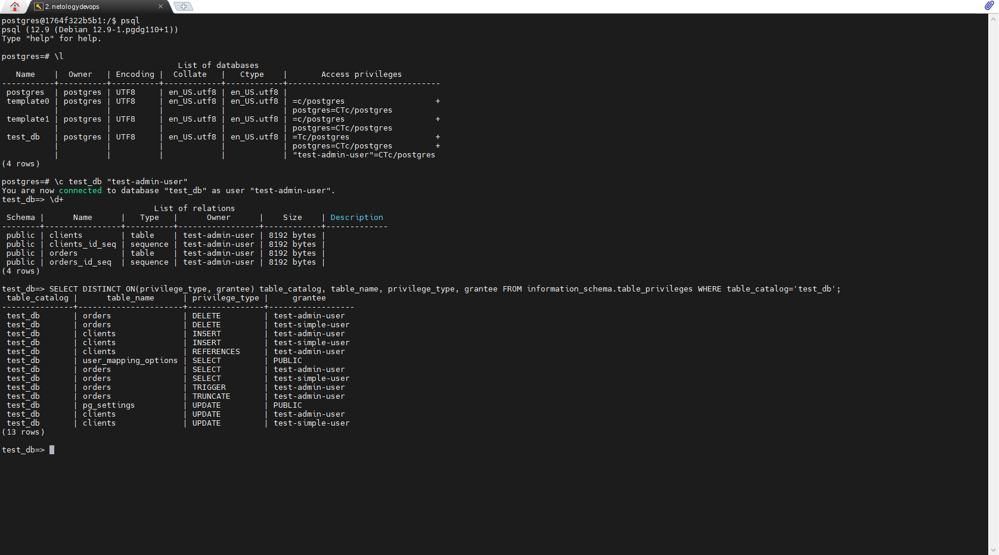

# Домашнее задание к занятию "6.2. SQL"

## Введение

Перед выполнением задания вы можете ознакомиться с 
[дополнительными материалами](https://github.com/netology-code/virt-homeworks/tree/master/additional/README.md).

## Задача 1

Используя docker поднимите инстанс PostgreSQL (версию 12) c 2 volume, 
в который будут складываться данные БД и бэкапы.

Приведите получившуюся команду или docker-compose манифест.

####Ответ:
```
docker run -itd -e POSTGRES_PASSWORD=netology -e PGDATA=/postgres_db/data --expose 5432 -p 5432:5432 -v /home/ganers/docker/volumes/postgres_db:/postgres_db/data/ -v /home/ganers/docker/volumes/postgres_bac:/postgres_bac postgres:12
```
## Задача 2

В БД из задачи 1: 
- создайте пользователя test-admin-user и БД test_db
- в БД test_db создайте таблицу orders и clients (спeцификация таблиц ниже)
- предоставьте привилегии на все операции пользователю test-admin-user на таблицы БД test_db
- создайте пользователя test-simple-user  
- предоставьте пользователю test-simple-user права на SELECT/INSERT/UPDATE/DELETE данных таблиц БД test_db

Таблица orders:
- id (serial primary key)
- наименование (string)
- цена (integer)

Таблица clients:
- id (serial primary key)
- фамилия (string)
- страна проживания (string, index)
- заказ (foreign key orders)

Приведите:
- итоговый список БД после выполнения пунктов выше,
- описание таблиц (describe)
- SQL-запрос для выдачи списка пользователей с правами над таблицами test_db
- список пользователей с правами над таблицами test_db

####Ответ:
<p align="center">
  
</p>

```
SELECT DISTINCT ON(privilege_type, grantee) table_catalog, table_name, privilege_type, grantee FROM information_schema.table_privileges WHERE table_catalog='test_db';
```

## Задача 3

Используя SQL синтаксис - наполните таблицы следующими тестовыми данными:

Таблица orders

|Наименование|цена|
|------------|----|
|Шоколад| 10 |
|Принтер| 3000 |
|Книга| 500 |
|Монитор| 7000|
|Гитара| 4000|

Таблица clients

|ФИО|Страна проживания|
|------------|----|
|Иванов Иван Иванович| USA |
|Петров Петр Петрович| Canada |
|Иоганн Себастьян Бах| Japan |
|Ронни Джеймс Дио| Russia|
|Ritchie Blackmore| Russia|

Используя SQL синтаксис:
- вычислите количество записей для каждой таблицы 
- приведите в ответе:
    - запросы 
    - результаты их выполнения.

#### Ответ:
```
INSERT INTO orders (naimenovanie, cena) VALUES ('Шоколад', 10), ('Принтер', 3000), ('Книга', 500), ('Монитор', 7000), ('Гитара', 4000);

INSERT INTO clients (familiya, strana_projyvaniya) VALUES ('Иванов Иван Иванович', 'USA'), ('Петров Петр Петрович', 'Canada'), ('Иоганн Себастьян Бах', 'Japan'), ('Ронни Джеймс Дио', 'Russia'), ('Ritchie Blackmore', 'Russia');

test_db=> SELECT COUNT(*) FROM clients;
 count
-------
     5
(1 row)

test_db=> SELECT COUNT(*) FROM orders;
 count
-------
     5
(1 row)

```

## Задача 4

Часть пользователей из таблицы clients решили оформить заказы из таблицы orders.

Используя foreign keys свяжите записи из таблиц, согласно таблице:

|ФИО|Заказ|
|------------|----|
|Иванов Иван Иванович| Книга |
|Петров Петр Петрович| Монитор |
|Иоганн Себастьян Бах| Гитара |

Приведите SQL-запросы для выполнения данных операций.

Приведите SQL-запрос для выдачи всех пользователей, которые совершили заказ, а также вывод данного запроса.
 
Подсказк - используйте директиву `UPDATE`.

#### Ответ:
```
UPDATE clients SET zakaz = (SELECT id FROM orders WHERE naimenovanie = 'Книга') WHERE familiya = 'Иванов Иван Иванович';
UPDATE clients SET zakaz = (SELECT id FROM orders WHERE naimenovanie = 'Монитор') WHERE familiya = 'Петров Петр Петрович';
UPDATE clients SET zakaz = (SELECT id FROM orders WHERE naimenovanie = 'Гитара') WHERE familiya = 'Иоганн Себастьян Бах';

test_db=> SELECT * FROM clients WHERE zakaz IS NOT NULL;
 id |       familiya       | strana_projyvaniya | zakaz
----+----------------------+--------------------+-------
  1 | Иванов Иван Иванович | USA                |     3
  2 | Петров Петр Петрович | Canada             |     4
  3 | Иоганн Себастьян Бах | Japan              |     5
(3 rows)
```

## Задача 5

Получите полную информацию по выполнению запроса выдачи всех пользователей из задачи 4 
(используя директиву EXPLAIN).

Приведите получившийся результат и объясните что значат полученные значения.

#### Ответ:
```
test_db=> EXPLAIN SELECT * FROM clients WHERE zakaz IS NOT NULL;
                        QUERY PLAN
-----------------------------------------------------------
 Seq Scan on clients  (cost=0.00..18.10 rows=806 width=72)
   Filter: (zakaz IS NOT NULL)
(2 rows)

test_db=> EXPLAIN (FORMAT JSON) SELECT * FROM clients WHERE zakaz IS NOT NULL;
              QUERY PLAN
---------------------------------------
 [                                    +
   {                                  +
     "Plan": {                        +
       "Node Type": "Seq Scan",       +
       "Parallel Aware": false,       +
       "Relation Name": "clients",    +
       "Alias": "clients",            +
       "Startup Cost": 0.00,          +
       "Total Cost": 18.10,           +
       "Plan Rows": 806,              +
       "Plan Width": 72,              +
       "Filter": "(zakaz IS NOT NULL)"+
     }                                +
   }                                  +
 ]
(1 row)


Из вывода запроса мы видим, что выполняется один фильтр "zakaz IS NOT NULL"
```

## Задача 6

Создайте бэкап БД test_db и поместите его в volume, предназначенный для бэкапов (см. Задачу 1).

Остановите контейнер с PostgreSQL (но не удаляйте volumes).

Поднимите новый пустой контейнер с PostgreSQL.

Восстановите БД test_db в новом контейнере.

Приведите список операций, который вы применяли для бэкапа данных и восстановления.

#### Ответ:
```
pg_dump -U postgres test_db > /postgres_bac/test_db_dump

В новом контейнере:
psql -U postgres
  CREATE DATABASE test_db;

pg_dump -U postgres test_db < /postgres_bac/test_db_dump

P.s. 
```